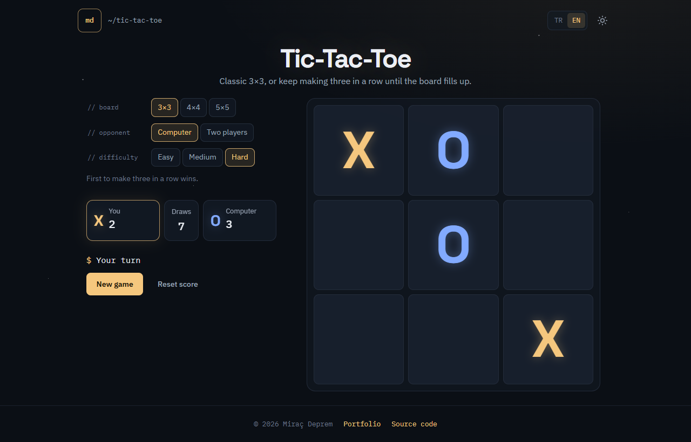
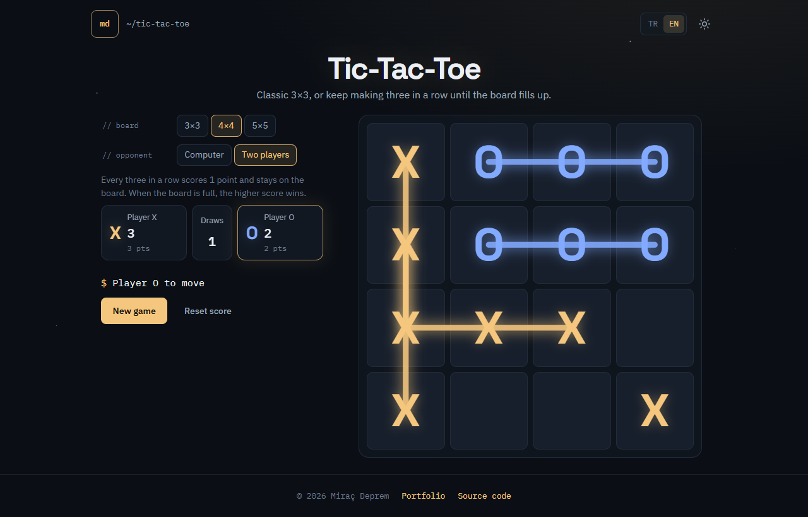
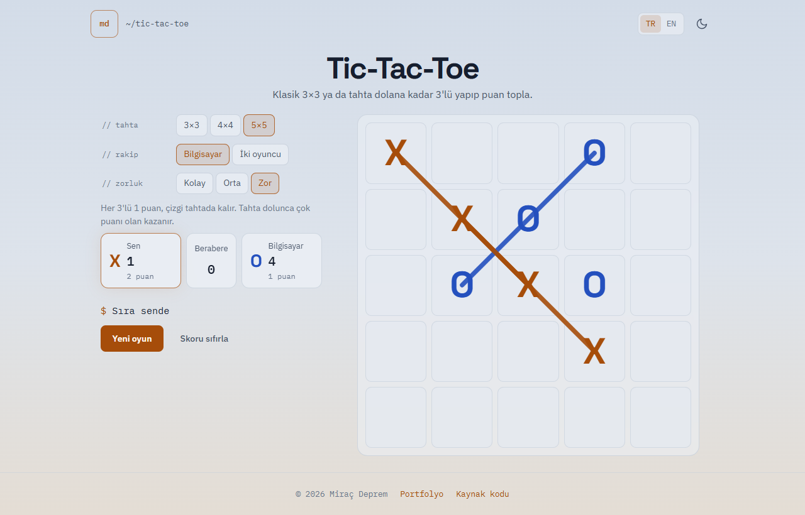
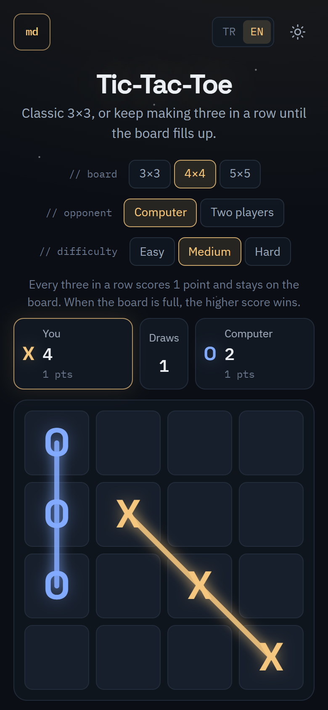

# Tic-Tac-Toe

**English** | [Türkçe](README.tr.md)

A tic-tac-toe game in plain HTML, CSS and JavaScript. Play the classic 3×3 game, or switch to a 4×4 or 5×5 board where every three in a row scores a point until the board is full. Play with a friend on the same device or against a computer opponent with three difficulty levels.

**Live demo:** [tictactoe.miracdeprem.com](https://tictactoe.miracdeprem.com)



## Features

- **Three board sizes**
  - **3×3** uses the classic rule: the first three in a row wins.
  - **4×4 and 5×5** use a scoring rule: every new three in a row scores 1 point and the line stays on the board. When the board is full, the higher score wins.
- **Two opponents**
  - A friend on the same device.
  - The computer, with three levels:
    - **Easy** plays random moves.
    - **Medium** takes wins, blocks threats and sometimes makes mistakes.
    - **Hard** uses minimax with alpha-beta pruning and never loses on 3×3.
- **Fair rounds:** the starting player alternates every round.
- **Scores per matchup**
  - Each combination of board, opponent and difficulty keeps its own score, so switching difficulty never mixes or erases scores.
  - Scores and settings are kept after a page refresh.
- **Accessible**
  - Full keyboard play (Tab + Enter).
  - Screen-reader labels for every cell.
  - Live announcements of turns and results.
  - Respects the "reduce motion" system setting.
- **Turkish and English**, with a **dark and light theme** that match my [portfolio](https://www.miracdeprem.com).
- **Responsive:** two columns on desktop, a single column on phones.
- **Feedback:** a small button opens a form (name optional, email or phone, message) that sends straight to me through my portfolio site.

## Screenshots

| 4×4 scoring mode | Light theme, 5×5 | Phone |
|---|---|---|
|  |  |  |

## Tech Stack

- HTML, CSS, JavaScript (ES modules, no framework, no build step)
- Node.js built-in test runner (`node --test`), 22 unit tests
- Hosted on Vercel

## Installation

Play it online at [tictactoe.miracdeprem.com](https://tictactoe.miracdeprem.com), or run it locally:

```bash
git clone https://github.com/MrcDprm/tic-tac-toe.git
cd tic-tac-toe
python -m http.server 5173
```

Then open `http://localhost:5173`. ES modules do not load from `file://`, so a local server is needed. Any static server works.

Run the tests (Node.js 20 or newer):

```bash
npm test
```

### Project structure

```
src/game.js        Game rules: board, moves, lines, scores, end of game
src/ai.js          Computer player (easy, medium, minimax)
src/storage.js     Settings and scores in localStorage, with validation
src/i18n.js        Turkish and English texts
src/theme.js       Theme switching
src/theme-init.js  Applies the saved theme before the first paint
src/main.js        Connects everything to the page
tests/             Unit tests for rules, AI and storage
```

## What I Learned

- **Separating the rules from the page.** All game rules live in `game.js` and know nothing about the page. The page only draws the current state. This let me test the rules in Node without a browser, and adding 4×4 and 5×5 boards only meant changing the rules.
- **Immutable state.** A move never changes the old game state; it returns a new one. That made invalid moves easy to detect (the same object comes back), and let the computer try moves without undoing anything.
- **Minimax with alpha-beta pruning.** The hard computer looks ahead by imagining my best reply to each of its moves. Alpha-beta pruning skips branches a smart opponent would never allow, and trying promising moves first makes it skip even more. On 3×3 it searches to the end of the game and never loses. On bigger boards it stops after a few moves and estimates the position by counting open lines.
- **Testing randomness.** The easy and medium levels use random numbers. I passed a seeded random number generator into the tests, so the same "random" games are played every time and the results are repeatable.
- **Not trusting saved data.** Anything read from `localStorage` can be broken or edited by hand. Every value is checked against a list of allowed values, and only known fields are saved.
- **Writing text safely.** Everything is written with `textContent` and `createElement`, never `innerHTML`, so no text can ever run as HTML.
- **CSS variables for theming.** Colors are defined once as variables. The light theme only changes their values, and the rest of the page follows. A tiny script applies the saved theme before the page is drawn, so there is no flash of the wrong theme.
- **Drawing with SVG.** Scored lines are SVG lines on top of the board. Setting the SVG coordinates to one unit per cell made the math simple: the center of a cell is just `column + 0.5, row + 0.5`.
- **Accessibility details.** I learned the difference between `disabled` and `aria-disabled`: a disabled button loses keyboard focus, so I used `aria-disabled` to keep the player's place on the board.

## Future Plans

- Choose to play as O against the computer
- Undo the last move
- Optional sound effects

## License

[MIT](LICENSE)
